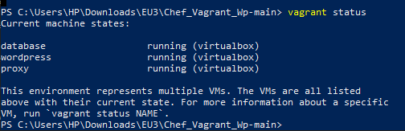
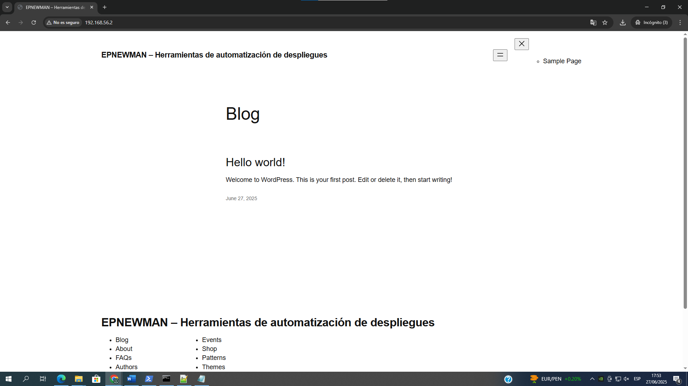
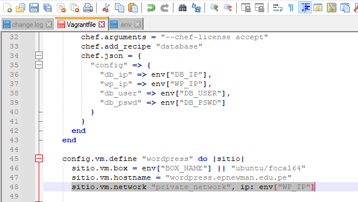

# Informe de Auditoría de Tecnologías de la Información

**Universidad Privada de Tacna**  
**Facultad de Ingeniería**  
**Escuela Profesional de Ingeniería de Sistemas**  

---

**Auditoría del Proceso de Despliegue Continuo de DevIA360 Basado en Vagrant y Chef**  
Curso: Auditoría de Sistemas  
Docente: Oscar Juan Jimenez Flores  

**Integrante:** De La Cruz Choque, Ricardo  
**Código:** 2019063329  

**Tacna – Perú, 2025**

---

## I. ORIGEN
La Auditoría de Tecnologías de la Información (TI) se realiza para evaluar el entorno de despliegue continuo de la solución DevIA360, la cual se basa en herramientas como Vagrant y Chef. El objetivo es asegurar el adecuado uso de los recursos tecnológicos, la correcta configuración de los entornos y la seguridad de la información involucrada en los procesos de aprovisionamiento automático.

## II. INFORMACIÓN DE LA ENTIDAD O DEPENDENCIA
- **Entidad/Dependencia:** DevIA360
- **Sector:** No Aplica
- **Nivel de Gobierno:** No Aplica

## III. DENOMINACIÓN DE LA MATERIA DE CONTROL
Auditoría del proceso de aprovisionamiento automatizado y despliegue continuo con Vagrant y Chef, orientado a servicios web sobre máquinas virtuales.

## IV. ALCANCE
La auditoría cubre el análisis del entorno de desarrollo creado con Vagrant y Chef, el despliegue de un entorno WordPress con tres máquinas virtuales (Base de datos, WordPress y Proxy) y las configuraciones de red, puertos, credenciales, y registros del sistema.

Período auditado: del 25 al 27 de junio de 2025.

## V. OBJETIVOS
**Objetivo General:**  
Evaluar el funcionamiento, seguridad y configuración del sistema de despliegue DevIA360 mediante herramientas de virtualización y aprovisionamiento.

**Objetivos Específicos:**
1. Verificar la correcta configuración de las máquinas virtuales creadas con Vagrant.
2. Evaluar la seguridad de las credenciales empleadas en los entornos.
3. Comprobar la conectividad y el acceso al servicio WordPress.
4. Identificar riesgos asociados a configuraciones de red y puertos.
5. Evaluar la presencia de registros de auditoría del sistema (logs).

## VI. PROCEDIMIENTOS DE AUDITORÍA

| Objetivos Específicos | Procedimientos                                                                 |
|------------------------|------------------------------------------------------------------------------|
| 1                      | Revisión de la estructura de Vagrant y estado de las VMs.                   |
| 2                      | Análisis de archivos `.env` y uso de credenciales en texto plano.            |
| 3                      | Prueba de acceso al entorno WordPress desde IP privada del proxy.           |
| 4                      | Verificación de configuración de red privada y redirección de puertos inseguros.|
| 5                      | Revisión de directorios `/var/log` en las VMs para validar existencia de logs.|

## VII. PLAZO DE LA AUDITORÍA Y CRONOGRAMA

| Etapa               | Fecha de Inicio | Fecha de Finalización |
|---------------------|------------------|-------------------------|
| Planificación       | 25/06/2025       | 25/06/2025              |
| Ejecución          | 26/06/2025       | 27/06/2025              |
| Elaboración del Informe | 27/06/2025       | 27/06/2025              |

## VIII. CRITERIOS DE AUDITORÍA
- Buenas prácticas de seguridad en TI (OWASP, ISO/IEC 27001)
- Configuración segura de entornos virtuales y servidores
- Buenas prácticas en aprovisionamiento automatizado (DevOps)
- Políticas de separación de entornos y protección de credenciales

## IX. INFORMACIÓN ADMINISTRATIVA

### IX.1 Comisión Auditora

| Cargo           | Nombres y Apellidos        | Profesion | Planificación | Ejecución | Informe | Total |
|----------------|-----------------------------|-----------|----------------|------------|---------|-------|
| Supervisor     | Oscar Juan Jimenez Flores  | Ingeniero | 1 día          | 2 días      | 1 día   | 4     |
| Auditor        | Ricardo De La Cruz Choque  | Estudiante| 1 día          | 2 días      | 1 día   | 4     |

### IX.2 Costos Directos Estimados

| Nº | Miembro  | Nivel   | Días | Costo H/H (S/.) | Asignación (S/.) | Total (S/.) |
|----|----------|---------|------|------------------|-------------------|--------------|
| 1  | Supervisor | Docente | 4    | 100.00           | 50.00             | 450.00       |
| 2  | Auditor    | Estudiante | 4 | 0.00             | 0.00              | 0.00         |
|    | **Total**  |         |      |                  |                   | **450.00**   |

## X. DOCUMENTO A EMITIR
Informe de Auditoría de Tecnologías de la Información, que incluirá conclusiones y recomendaciones con base en los hallazgos evidenciados durante la auditoría.

**Lugar y Fecha:** Tacna, 27 de junio de 2025

**Firmas:**
- Oscar Juan Jimenez Flores (Supervisor)
- Ricardo De La Cruz Choque (Auditor)

---

## ANEXO 1: MATRIZ DE RIESGOS EN TI

| Riesgo                           | Causa (Vínculo a Anexo)              | Impacto | Probabilidad | Nivel de Riesgo |
|----------------------------------|--------------------------------------|---------|--------------|-----------------|
| Puertos expuestos sin control    | `Vagrantfile` (C)                    | Medio   | 80%          | Alto            |
| Red privada sin autenticación    | `Vagrantfile` (D_1, D_2)            | Medio   | 70%          | Alto            |
| Credenciales en texto plano      | `.env` (E)                           | Alto    | 90%          | Crítico         |
| Falta de segregación de entornos | No se encontraron `attributes/*.rb` | Medio   | 75%          | Alto            |

---

## ANEXO 2: EVIDENCIAS

- **Anexo A**: `anexo_A_vagrant_status.png`
- **Anexo B**: `anexo_B_wordpress_acceso.png`
- **Anexo C**: `anexo_C_puerto_sin_autenticacion.png`
- **Anexo D.1**: `anexo_D_1_red_privada_sin_autenticacion.png`
- **Anexo D.2**: `anexo_D_2_red_privada_sin_autenticacion.png`
- **Anexo E**: `anexo_E_credenciales_env_no_seguro.png`
- **Anexo G**: `anexo_G_logs_existentes.png`

---

### Visualización de Evidencias (opcional):

  
  
  
  
  
  
